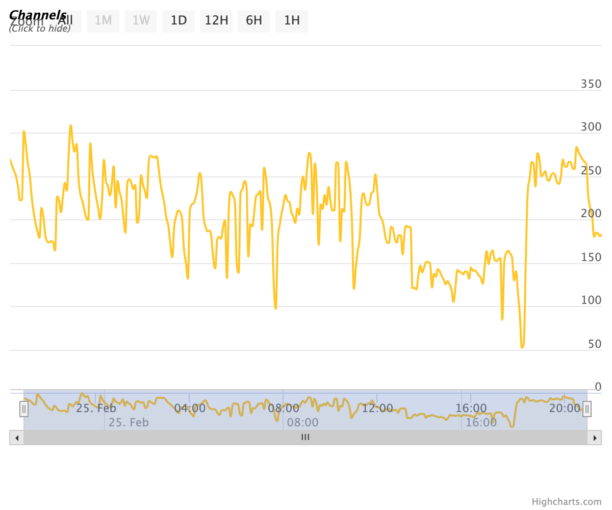

# The Texas Crutch

The Texas Crutch is a well-known barbecue technique that pitmasters use to improve resource usage during a long cook. In a time where 86% of restaurants are reporting a drop in profit margins over the last year, resource management is paramount[[1]](#references). But is wrapping a brisket the only way to increase return on investment as a restaurant owner? And is the real Texas Crutch actually the weather?

Whether or not Austin has a meteorological advantage, protecting a smoker from the elements is commonly thought of as helpful. Dry, still air is a good thermal insulator. But merely introducing convection changes the game, let alone precipitation. Water has a higher specific heat capacity and a higher heat transfer coefficient than air, making it an effective coolant.

It follows that chefs, trying to maintain as constant a temperature as possible over half a day, seek to remove these competing factors. But if a roof alone costs $10,000 does it ever pay for itself in fuel saved, reduced waste, or improved quality? Smoking a brisket will always be an art, but data-driven methods can tease out relationships that allow pitmasters to focus on their craft.

## Follow the Data

With Austin's Franklin Barbecue already on his resume, Chef Karl Fallenius opened Denver's Owlbear Barbecue on May 9, 2019[[2]](#references). Since then, his windy corner has been an olfactory temptation for passers-by - rooted in Central Texas techniques, but with a Denver twist. It is this unique combination that makes Owlbear a valuable study. Regionality in smoked brisket is often debated, with the focus on wood or ingredient sourcing. This examination, however, is focused on regional weather.

#### Figure 1: Flow of Data


### Data Ingestion

- Purpose of automated pipeline is 24/7 ingestion availability, matching the cook
    - Scheduled Cloud Function API calls to OpenWeatherMap API[[3]](#references) & API in Azure
    - Scheduled Spark Cluster Workflow Templating<sup>†</sup>
- Initial load
- API calls instead of subscribing to publisher
- Security: Keys secured in GCP Secret Manager, enabling ephemerality
- Stem the tide of streaming data
    - Cook chamber temperature data streams in near real time<sup>‡</sup>
    - Gradually step down in rate since real time delivery is costly & not needed

#### Figure 2: OEM Probe Data Example


<sup>†</sup>Dataproc automation has been postponed and will be integrated into v0.2.

<sup>‡</sup>While the cloud thermocouple was installed on 2/24/21 and is gathering temperature data, this portion of the pipeline has also been postponed and will be integrated into v0.2.

### Data Transformation

- Mixed file types
    - Multiline JSON Weather at Owlbear Example:
```
{"reference_time": 1614222001,
 "sunset_time": 1614213986,
 "sunrise_time": 1614174005,
 "clouds": 100,
 "rain": {},
 "snow": {"1h": 0.87},
 "wind": {"speed": 2.68,
          "deg": 329,
          "gust": 8.94},
 "humidity": 89,
 "pressure": {"press": 1026,
              "sea_level": null},
 "temperature": {"temp": 270.21,
                 "temp_kf": null,
                 "temp_max": 272.04,
                 "temp_min": 268.71,
                 "feels_like": 265.78},
 ...
```

- Cleaning
    - Java heap space `OutOfMemoryError`
- Preparation for analysis

#### Compaction

- File read time issues
    - 72.9x read time factor
    - One successful read of subset took 14 minutes
- Parquet    
    - Computing time v. Engineering time

### Data Insight

- Coming soon to a theater near you!

## References
1. [National Restaurant Association Report](https://restaurant.org/downloads/pdfs/advocacy/covid-19-restaurant-impact-survey-v-state-results)
1. [Owlbear Opens Brick-and-Mortar](https://www.denverpost.com/2019/05/09/owlbear-barbecue-restaurant-open-denver/)
1. [Open Weather Map API](http://api.openweathermap.org/)

[(top)](#the-texas-crutch)